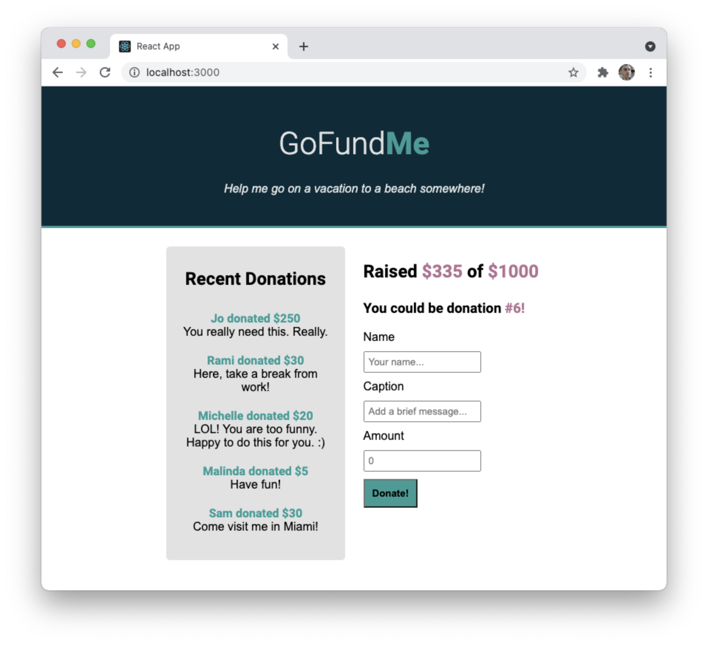

# React Props Lab

Pass props through multiple components to build a mockup of a "FundMe"-type website.



---

## Lab Setup


### Getting started

1. Fork and clone this repository.

2. Navigate to the cloned repository's directory on your command line. Then, run the following command:

   ```
   npm install
   ```

   This will install the libraries needed.

3. Open up the repository in VSCode. Follow the instructions below to complete the Lab.

4. Deploy this application to Netlify and add the link to your netlify site below:

- [https://extraordinary-lamington-ff5397.netlify.app/]()

## Instructions

Inside of the `App.js` file are two variables which will serve as props for your application:

1. `targetAmount`: A number, in dollars, that represents the total amount of money attempting to be raised.

2. `donations`: An array of objects, where each object represents a donation.

Create each component in the `Components/` directory and pass props from the `App` component to each of the components to create the mockup as seen above. HTML snippets for each component is included below.

### Components

Each of the components below must be completed and must make use of props. A "hardcoded" HTML snippet is included below so that you can focus on passing props as opposed to creating HTML. _Do not_ just copy and paste the HTML into the component and update the text. While this may pass the tests, it does not demonstrate you know anything about props.

#### DonationForm

For the donation form, you will need to update the sentence "You could be donation #1!" so that instead of being hardcoded to the number `1`, it is set to a number one above the actual number of donations.

```html
<section className="donation">
  <h3>You could be donation <span class="secondary">#1!</span></h3>
  <form>
    <label htmlFor="name"
      >Name<input
        id="name"
        name="name"
        type="text"
        placeholder="Your name..." /></label
    ><label htmlFor="caption"
      >Caption<input
        id="caption"
        name="caption"
        type="text"
        placeholder="Add a brief message..." /></label
    ><label htmlFor="amount"
      >Amount<input
        id="amount"
        name="amount"
        type="number"
        placeholder="0" /></label
    ><button>Donate!</button>
  </form>
</section>
```

### Progress

For the progress section, you will need to replace the value `$0` with a dynamic value based on the donations.

```html
<section className="progress">
  <h2>
    Raised <span className="secondary">$0</span> of
    <span className="secondary">$1000</span>
  </h2>
</section>
```

### Recent Donations

For the recent donations section, you will need to have a number of `li` elements equal to the number of donations. Each `li` should include the person who donated, the amount, and their caption.

```html
<section>
  <h2>Recent Donations</h2>
  <ul>
    <li><span>Jo donated $25</span>You really need this. Really.</li>
    <li><span>Rami donated $10</span>Here, take a break from work!</li>
    <!-- etc... -->
  </ul>
</section>
```
